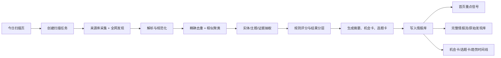
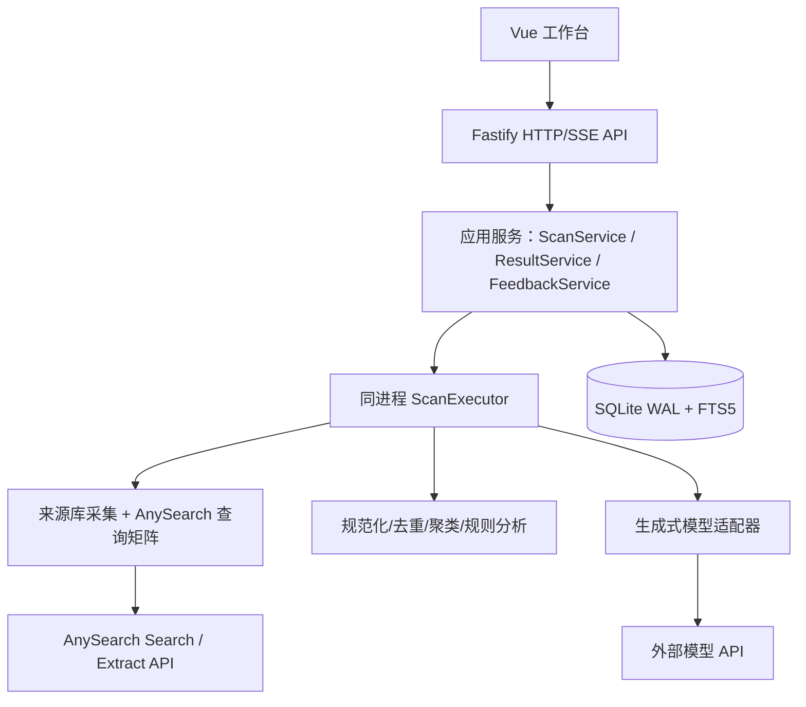

# AI 情报工作台研发方案设计

- 方案状态：讨论中（AnySearch 已确认，首批来源与生成式模型待确认）
- 需求目录：`ai-intelligence/docs/ai-intelligence-workbench/`
- 需求依据：[产品需求文档.md](./产品需求文档.md)、[产品原型.md](./产品原型.md)
- 方案版本：v0.4
- 本次变更：采用单 Node.js 进程和 SQLite，移除独立 Worker、Redis、PostgreSQL、向量数据库和 Jev；核心判断由代码规则完成；前端统一使用 Element Plus 并以产品原型为验收基准；使用精简的管道、策略、适配器、状态机、Repository、观察者和前端组合模式减少重复。

## 1. 产品结果与整体描述

### 1.1 产品最终交付结果

用户从 Web 工作台点击“开始扫描”，选择时间范围后，最终得到三类可用结果：

1. 可回溯原始链接、来源和证据的完整 AI 情报流；
2. 按副业价值筛出的机会卡，包含验证动作和风险；
3. 按内容价值筛出的选题卡，包含事实、观点和多平台切入角度。

产品完成的条件是：用户能从真实页面发起一次扫描，看到任务进度，浏览本轮完整结果，打开一条情报核查证据，并在同一轮结果中得到可继续验证的机会卡或选题卡。数据库建表、采集接口或模型调用单独通过都不代表产品完成。

### 1.2 业务目标与边界

- 自动发现公开互联网中的 AI 新闻、论文、产品发布、融资、公司动作和真实落地案例。
- 同时监测高质量来源库与来源库之外的全网新信号。
- 重点覆盖开发者工具/Agent/自动化、企业服务、内容营销电商、教育和个人效率。
- 保留大规模完整情报，不用固定数量的精选结果替代全量发现。
- 通过去重、事件聚类、证据标注、自有评分和生成式摘要降低判断成本。
- 首版单用户、桌面优先，不做登录、权限、多租户、自动发布、付费内容抓取或完整文章/脚本生成。

### 1.3 角色、入口和数据范围

- 角色：产品所有者本人，无组织和租户隔离。
- 真实入口：`今日扫描`页的时间范围选择器和“开始扫描”按钮。
- 公共数据范围：公开网页、公开 RSS、公开论文/代码/产品页和公开案例页面。
- 外部生成式模型：只用于摘要、事实抽取、机会卡和选题卡草稿；最终状态、评分、证据门槛和排序由本地代码决定。

## 2. 用户主链路与端到端状态机

### 2.1 端到端流程



### 2.2 任务状态机

```text
created
  -> collecting
  -> normalizing
  -> clustering
  -> analyzing
  -> generating
  -> completed

任意处理中状态 -> partial_failed（部分来源失败但仍有结果）
任意处理中状态 -> failed（没有可交付结果或任务不可恢复）
created/partial_failed -> retrying -> 原步骤或下一安全步骤
```

任务状态持久化在 SQLite。单 Node.js 进程中的异步任务执行器负责推进状态；服务重启后将超时的处理中任务标记为 `partial_failed` 或可重试，不依赖内存队列恢复。

### 2.3 全局状态和幂等规则

- `scan_tasks.task_id` 是任务幂等标识；同一请求重放不能创建重复任务。
- 原始内容按规范化 URL、标题指纹和正文指纹去重；同一事件的新来源作为证据关联，不覆盖原始记录。
- 每个来源有独立的超时、重试和错误状态；单个来源失败不得使已有结果全部丢失。
- 扫描结果写入采用事务；页面只能读取已提交的结果。
- 同时只允许一个扫描任务执行，重复点击返回当前运行任务；未来可把并发上限配置化。

## 3. 目标架构与技术基线

### 3.1 技术选型

```text
前端：Vue 3 + TypeScript + Vite + Element Plus + @element-plus/icons-vue
后端：Node.js + Fastify + TypeScript
数据库：SQLite（WAL、外键、FTS5）
任务执行：同一 Node.js 进程内的异步任务执行器，不使用独立进程、worker_threads 或消息队列
采集：来源库使用 Node 原生 fetch、RSS 解析和站点公开 API；全网发现与缺失正文提取使用 AnySearch REST API
模型：可替换的生成式模型适配器 + Zod 结构校验
测试：Node 测试运行器/项目选定测试框架、真实 SQLite、Playwright 浏览器 E2E
```

#### 3.1.1 前端实现约束

1. 前端组件库固定为 Element Plus，标准按钮、表单、输入框、选择器、切换开关、标签、进度、分页、弹窗、消息提示、骨架屏、空状态和 Tooltip 必须优先使用对应的 Element Plus 组件，不自行重复实现通用 UI 能力。
2. 图标优先使用 `@element-plus/icons-vue`，不再引入第二套图标库，不手写通用 SVG 图标。
3. 业务组件只抽取原型中真实重复的组合，如 `SignalCard`、`EvidencePanel`、`ScanControl`、`OpportunityCard` 和 `ContentTopicCard`；不对 `ElButton`、`ElDialog` 等基础组件再做无业务价值的包装。
4. 页面信息架构、菜单顺序、文案、卡片密度、颜色、字号、间距、状态和交互必须严格按 [产品原型.md](./产品原型.md) 及 [可交互原型](./原型/index.html) 实现。Element Plus 默认样式与原型不一致时，通过 CSS 变量、主题 token 和局部样式调整，不得为了套用默认样式改变原型。
5. 允许自定义的范围仅限于页面布局、业务复合组件和原型视觉样式。任何信息架构、核心交互或视觉层级的偏离，必须先更新原型并经用户确认，不得在实施阶段自行改版。
6. 不引入其他 UI 组件库；Element Plus 已提供的能力不新增自制组件、第三方依赖或并行设计系统。

### 3.2 架构职责



不引入 Redis、PostgreSQL、Elasticsearch、Celery、LangChain、独立 Worker 或向量数据库。只有当真实指标显示 CPU 密集计算、并发任务或服务隔离成为瓶颈时，才单独评估 `worker_threads` 或进程拆分。

### 3.3 目标目录与模块落位

当前子项目只有文档和静态原型，以下是实施时新增的明确目标路径：

```text
ai-intelligence/
├── apps/web/src/
│   ├── views/                # 八个工作台菜单页
│   ├── components/           # 仅放 ScanControl、SignalCard、EvidencePanel 等可复用业务组件
│   ├── composables/          # 扫描进度、分页结果和用户状态的共享逻辑
│   ├── api/                  # HTTP/SSE 客户端
│   └── stores/               # 任务和筛选状态
├── server/src/
│   ├── app.ts                # Fastify 装配与启动
│   ├── routes/               # scans、signals、opportunities、entities 等路由
│   ├── application/          # ScanService、Pipeline ScanExecutor、taskEvents 和其他应用服务
│   ├── domain/               # 状态转换表、评分策略、证据和聚类规则
│   ├── ingestion/            # collectors 策略注册、AnySearchClient 适配器和查询矩阵
│   ├── generation/           # LlmClient、Prompt、Schema
│   ├── persistence/          # SQLite connection、具体 repositories、migrations
│   └── observability/        # 结构化日志和 request/task correlation
├── server/migrations/        # 幂等 SQLite migration
└── tests/
    ├── unit/                 # 规则、去重、状态和解析边界
    ├── business/             # BT-xxx
    └── e2e/                  # E2E-xxx，真实入口和 SQLite
```

### 3.4 设计模式与复用边界

设计模式只用于当前已经存在的变化点和重复逻辑，不为潜在需求预建类层级。首版固定使用以下模式。

#### 3.4.1 Pipeline：扫描任务管道

`server/src/application/ScanExecutor.ts` 使用有序步骤数组串联 `collecting -> normalizing -> clustering -> analyzing -> generating`，每个步骤是接收 `taskId` 和执行上下文的异步函数。`runStep` 统一处理步骤状态、计数、日志、异常和重试边界，具体步骤不重复这些框架逻辑。

不引入通用工作流引擎、`PipelineFactory` 或 Template Method 类继承；有序函数管道已能满足单一扫描流程。

#### 3.4.2 Strategy + Registry：来源采集与评分

`server/src/ingestion/collectors/index.ts` 按 `source.kind` 注册 `rss`、`api`、`webpage` 三个采集函数，调用方通过映射选择实现，不在扫描管道内堆叠 `if/else`。三个采集器统一输出 `RawDiscoveryInput`，但各自保留超时、解析和错误语义。

`server/src/domain/scoring.ts` 使用评分规则函数数组累加证据强度、新颖性、落地程度、个人可执行性、可变现性和内容价值。每条规则返回分数与原因，统一汇总为可解释结果；不建设通用规则引擎。

#### 3.4.3 Adapter：外部依赖隔离

- `server/src/ingestion/AnySearchClient.ts` 封装 `/v1/search` 和 `/v1/extract`，将外部请求、响应、限额和错误转换为系统内部对象与六位业务错误码。
- `server/src/ingestion/collectors/*.ts` 将 RSS、公开 API 和网页的差异转换为统一 `RawDiscoveryInput`。
- `server/src/generation/LlmClient.ts` 将外部模型输出转换为经 Zod 校验的卡片草稿。首版只有一个生成式模型供应商时不创建抽象工厂；第二个真实供应商接入后再抽取供应商策略。

路由、应用服务和领域规则不得直接读取外部供应商的原始字段。

#### 3.4.4 显式状态机：合法状态转换

`server/src/domain/taskTransitions.ts` 使用只读映射定义扫描任务的允许转换，并通过纯函数 `assertTaskTransition` 校验合法性。`server/src/application/ScanService.ts` 的 `transitionTask` 是任务状态变更的唯一应用入口，负责调用领域校验、事务更新、写日志，并在提交后发送进度事件。机会卡和选题卡的工作流状态使用同样的转换表方式，分别放在其领域模块内。

不为每个状态创建类；转换表和纯函数是本系统规模下的完整实现。

#### 3.4.5 Repository：SQLite 访问边界

`server/src/persistence/repositories/` 中按业务对象建立 `ScanTaskRepository`、`SourceRepository`、`SignalRepository`、`OpportunityRepository`、`ContentTopicRepository` 和 `ItemStateRepository`。路由只调用应用服务，应用服务通过具体 Repository 执行 SQL，不把 SQL 散落在路由、采集器或 Vue 接口层。

不创建 `BaseRepository<T>`、通用 CRUD 生成器或 Unit of Work 类。SQLite 事务直接由连接模块提供的单个 `transaction` 辅助函数包裹。

#### 3.4.6 Observer：扫描进度通知

`server/src/application/taskEvents.ts` 使用 Node.js 原生 `EventEmitter` 发送步骤进度、新信号和任务结束事件，SSE 路由订阅对应 `taskId` 并转发。只有数据库事务提交后才允许发送事件；SQLite 是最终状态来源，断线恢复依然查询任务接口。

不建设自研事件总线、持久化事件队列或消息中间件。

#### 3.4.7 Composition：Vue 页面复用

Vue 页面使用 Element Plus 组件、业务复合组件和精简 composable 组装：

- `apps/web/src/composables/useScanProgress.ts` 集中管理 SSE 连接、心跳、断线后任务查询和页面进度状态。
- `apps/web/src/composables/usePagedResults.ts` 仅在情报、机会、选题等多个列表存在相同的 `cursor/loading/error` 逻辑时抽取。
- `apps/web/src/composables/useItemState.ts` 集中收藏、忽略、归档和恢复的请求、乐观状态与失败回滚。

不把页面强行塞入“万能列表”或“万能弹窗”；只有第二个真实调用方出现时才抽取共享逻辑。

#### 3.4.8 明确不采用

首版不使用抽象工厂、多层类继承、通用规则引擎、CQRS、Event Sourcing、自研依赖注入容器、Generic Repository、万能前端组件或独立消息总线。以上能力只在出现第二个真实实现、无法用现有函数组合消除的重复，或有可复现的性能/隔离问题后再评估。

## 4. 数据模型与接口契约

### 4.1 核心表

数据库文件由配置项 `SQLITE_PATH` 指定。连接初始化必须执行以下幂等设置：

```sql
PRAGMA foreign_keys = ON;
PRAGMA journal_mode = WAL;
PRAGMA synchronous = NORMAL;
PRAGMA busy_timeout = 5000;
```

通用约定：

- 业务表主键统一使用 `INTEGER PRIMARY KEY`，由 SQLite 自动分配并直接复用 rowid；不使用 `AUTOINCREMENT`，业务排序必须使用明确的时间或排序字段，不能依赖 ID 连续性。
- 时间统一使用 UTC ISO 8601 文本，例如 `2026-09-23T08:30:00.000Z`；同一字段始终保持相同格式，以便直接排序。
- 布尔值使用 `INTEGER NOT NULL CHECK (... IN (0, 1))`。
- JSON 字段必须有 `json_valid` 约束；需要筛选、排序或关联的值不得只放在 JSON 中。
- `error_code/last_error_code` 使用六位整数业务错误码，无错误时为 `NULL`；HTTP 状态和外部供应商错误码不得直接写入这些字段。
- 所有 `CREATE TABLE`、`CREATE INDEX`、FTS 表和触发器均使用 `IF NOT EXISTS`，迁移脚本可重复执行。

#### 4.1.1 `scan_tasks`：扫描任务

```sql
CREATE TABLE IF NOT EXISTS scan_tasks (
    task_id INTEGER PRIMARY KEY,
    idempotency_key TEXT NOT NULL UNIQUE,
    range_from TEXT NOT NULL,
    range_to TEXT NOT NULL,
    status TEXT NOT NULL CHECK (status IN (
        'created', 'collecting', 'normalizing', 'clustering',
        'analyzing', 'generating', 'retrying',
        'completed', 'partial_failed', 'failed'
    )),
    current_step TEXT,
    progress INTEGER NOT NULL DEFAULT 0 CHECK (progress BETWEEN 0 AND 100),
    discovered_count INTEGER NOT NULL DEFAULT 0 CHECK (discovered_count >= 0),
    signal_count INTEGER NOT NULL DEFAULT 0 CHECK (signal_count >= 0),
    opportunity_count INTEGER NOT NULL DEFAULT 0 CHECK (opportunity_count >= 0),
    content_topic_count INTEGER NOT NULL DEFAULT 0 CHECK (content_topic_count >= 0),
    error_code INTEGER CHECK (error_code IS NULL OR error_code BETWEEN 100000 AND 999999),
    error_message TEXT,
    heartbeat_at TEXT,
    created_at TEXT NOT NULL,
    started_at TEXT,
    finished_at TEXT,
    CHECK (range_from < range_to),
    CHECK (finished_at IS NULL OR started_at IS NOT NULL)
) STRICT;

CREATE UNIQUE INDEX IF NOT EXISTS uq_scan_tasks_single_active
ON scan_tasks ((1))
WHERE status IN (
    'created', 'collecting', 'normalizing', 'clustering',
    'analyzing', 'generating', 'retrying'
);

CREATE INDEX IF NOT EXISTS idx_scan_tasks_created_at
ON scan_tasks (created_at DESC);
```

字段与约束：

- `idempotency_key`：前端每次点击生成，网络重试时复用；唯一约束防止重复建任务。
- `range_from/range_to`：用户选择的扫描时间窗，必须满足开始时间早于结束时间。
- `status/current_step/progress`：驱动页面状态和恢复逻辑；进度只能为 0～100。
- 四个 `*_count`：页面概览数字，只保存已提交数据的计数。
- `heartbeat_at`：判断服务重启后遗留任务是否失活。
- 部分唯一索引保证首版全库只能存在一个活动扫描任务。

#### 4.1.2 `scan_task_steps`：任务步骤

```sql
CREATE TABLE IF NOT EXISTS scan_task_steps (
    task_id INTEGER NOT NULL,
    step_name TEXT NOT NULL CHECK (step_name IN (
        'collecting', 'normalizing', 'clustering', 'analyzing', 'generating'
    )),
    status TEXT NOT NULL CHECK (status IN (
        'pending', 'running', 'completed', 'partial_failed', 'failed', 'skipped'
    )),
    items_total INTEGER NOT NULL DEFAULT 0 CHECK (items_total >= 0),
    items_done INTEGER NOT NULL DEFAULT 0 CHECK (items_done >= 0),
    error_code INTEGER CHECK (error_code IS NULL OR error_code BETWEEN 100000 AND 999999),
    error_message TEXT,
    started_at TEXT,
    finished_at TEXT,
    PRIMARY KEY (task_id, step_name),
    FOREIGN KEY (task_id) REFERENCES scan_tasks(task_id) ON DELETE CASCADE,
    CHECK (items_done <= items_total OR items_total = 0)
) STRICT;
```

字段与约束：

- 一项任务的每个 `step_name` 只有一行，重复执行通过 `UPDATE` 恢复，不新增重复步骤。
- `items_total/items_done` 用于 SSE 进度；未知总数时 `items_total=0`。
- 删除任务时级联删除步骤，但正常产品操作不提供删除已完成任务的入口。

#### 4.1.3 `sources`：高质量来源库

```sql
CREATE TABLE IF NOT EXISTS sources (
    source_id INTEGER PRIMARY KEY,
    name TEXT NOT NULL,
    source_group TEXT NOT NULL,
    kind TEXT NOT NULL CHECK (kind IN ('rss', 'api', 'web')),
    url TEXT NOT NULL UNIQUE,
    language TEXT NOT NULL CHECK (language IN ('zh-CN', 'en', 'mixed')),
    region TEXT NOT NULL CHECK (region IN ('cn', 'intl', 'global')),
    trust_level INTEGER NOT NULL CHECK (trust_level BETWEEN 1 AND 5),
    enabled INTEGER NOT NULL DEFAULT 1 CHECK (enabled IN (0, 1)),
    fetch_interval_minutes INTEGER NOT NULL DEFAULT 1440
        CHECK (fetch_interval_minutes >= 5),
    last_checked_at TEXT,
    last_success_at TEXT,
    last_error_code INTEGER CHECK (
        last_error_code IS NULL OR last_error_code BETWEEN 100000 AND 999999
    ),
    created_at TEXT NOT NULL,
    updated_at TEXT NOT NULL
) STRICT;

CREATE INDEX IF NOT EXISTS idx_sources_enabled_group
ON sources (enabled, source_group, kind);
```

字段与约束：

- `source_group`：官方公司、论文、开源社区、科技媒体、行业案例等前端来源分组。
- `kind`：决定使用 RSS、公开 API 还是普通网页采集函数。
- `trust_level`：1～5 的人工来源等级，是证据评分输入，不等于单篇内容真实性。
- `url` 唯一，避免同一入口重复采集。
- `last_*` 字段支持来源健康状态和失败定位。

#### 4.1.4 `search_runs`：AnySearch 单次查询记录

```sql
CREATE TABLE IF NOT EXISTS search_runs (
    search_run_id INTEGER PRIMARY KEY,
    task_id INTEGER NOT NULL,
    query_key TEXT NOT NULL,
    query_version TEXT NOT NULL,
    query_text TEXT NOT NULL,
    zone TEXT NOT NULL CHECK (zone IN ('cn', 'intl')),
    language TEXT NOT NULL CHECK (language IN ('zh-CN', 'en')),
    status TEXT NOT NULL CHECK (status IN ('running', 'completed', 'failed')),
    anysearch_request_id TEXT,
    result_count INTEGER NOT NULL DEFAULT 0 CHECK (result_count BETWEEN 0 AND 10),
    duration_ms INTEGER CHECK (duration_ms IS NULL OR duration_ms >= 0),
    error_code INTEGER CHECK (error_code IS NULL OR error_code BETWEEN 100000 AND 999999),
    started_at TEXT NOT NULL,
    finished_at TEXT,
    UNIQUE (task_id, query_key, zone, language),
    FOREIGN KEY (task_id) REFERENCES scan_tasks(task_id) ON DELETE CASCADE
) STRICT;

CREATE INDEX IF NOT EXISTS idx_search_runs_task_status
ON search_runs (task_id, status);
```

字段与约束：

- 一行对应一次 `/v1/search` 请求；`query_key` 是稳定业务标识，`query_text` 是实际发送文本。
- `query_version` 使扫描结果可回溯到当时使用的查询矩阵。
- `result_count` 按 AnySearch 当前接口约束限制为 0～10。
- `anysearch_request_id` 只记录服务端请求标识；API Key 和包含凭据的 402 `message` 禁止入库。
- 唯一约束防止同一任务重复执行同一个区域/语言查询。

#### 4.1.5 `raw_discoveries`：规范化前的原始发现

```sql
CREATE TABLE IF NOT EXISTS raw_discoveries (
    discovery_id INTEGER PRIMARY KEY,
    source_id INTEGER,
    url TEXT NOT NULL,
    normalized_url TEXT NOT NULL,
    title TEXT NOT NULL DEFAULT '',
    snippet TEXT NOT NULL DEFAULT '',
    content TEXT NOT NULL DEFAULT '',
    published_at TEXT,
    published_at_verified INTEGER NOT NULL DEFAULT 0
        CHECK (published_at_verified IN (0, 1)),
    fetched_at TEXT NOT NULL,
    content_hash TEXT NOT NULL,
    status TEXT NOT NULL CHECK (status IN (
        'candidate', 'accepted', 'rejected', 'extract_failed'
    )),
    rejection_reason TEXT,
    first_seen_at TEXT NOT NULL,
    last_seen_at TEXT NOT NULL,
    UNIQUE (normalized_url, content_hash),
    FOREIGN KEY (source_id) REFERENCES sources(source_id) ON DELETE SET NULL
) STRICT;

CREATE INDEX IF NOT EXISTS idx_raw_discoveries_published
ON raw_discoveries (published_at DESC);

CREATE INDEX IF NOT EXISTS idx_raw_discoveries_status_seen
ON raw_discoveries (status, last_seen_at DESC);
```

字段与约束：

- `source_id` 只用于来源库发现；AnySearch 结果可以为空。
- `normalized_url` 去除跟踪参数并规范域名、路径和尾斜杠。
- `content_hash` 对规范化正文计算；同一 URL 内容变化时允许形成新版本。
- `published_at_verified=0` 表示发布时间无法可靠确认，只能进入原始发现库，不能成为本期重点。
- `rejected` 不物理删除数据，`rejection_reason` 保存过滤原因。

#### 4.1.6 `scan_discoveries`：任务与原始发现关联

```sql
CREATE TABLE IF NOT EXISTS scan_discoveries (
    task_id INTEGER NOT NULL,
    discovery_id INTEGER NOT NULL,
    discovery_channel TEXT NOT NULL CHECK (discovery_channel IN ('source', 'anysearch', 'both')),
    discovered_at TEXT NOT NULL,
    PRIMARY KEY (task_id, discovery_id),
    FOREIGN KEY (task_id) REFERENCES scan_tasks(task_id) ON DELETE CASCADE,
    FOREIGN KEY (discovery_id) REFERENCES raw_discoveries(discovery_id) ON DELETE CASCADE
) STRICT;

CREATE INDEX IF NOT EXISTS idx_scan_discoveries_discovery
ON scan_discoveries (discovery_id, task_id);
```

字段与约束：

- 原始发现跨扫描复用，本表回答“某一轮扫描发现了什么”。
- 同一任务通过两个渠道发现同一内容时将 `discovery_channel` 更新为 `both`，只保留一条任务关联；更细的搜索溯源由下一张表保存。

#### 4.1.7 `discovery_search_runs`：发现与搜索请求关联

```sql
CREATE TABLE IF NOT EXISTS discovery_search_runs (
    discovery_id INTEGER NOT NULL,
    search_run_id INTEGER NOT NULL,
    result_rank INTEGER NOT NULL CHECK (result_rank BETWEEN 1 AND 10),
    PRIMARY KEY (discovery_id, search_run_id),
    FOREIGN KEY (discovery_id) REFERENCES raw_discoveries(discovery_id) ON DELETE CASCADE,
    FOREIGN KEY (search_run_id) REFERENCES search_runs(search_run_id) ON DELETE CASCADE
) STRICT;

CREATE INDEX IF NOT EXISTS idx_discovery_search_runs_search_rank
ON discovery_search_runs (search_run_id, result_rank);
```

字段与约束：

- 保存一条内容被哪些 AnySearch 查询命中以及当时排名。
- 同一内容可以被多个查询命中，这是去重和查询效果评估的依据。

#### 4.1.8 `signals`：去重聚类后的情报信号

```sql
CREATE TABLE IF NOT EXISTS signals (
    signal_id INTEGER PRIMARY KEY,
    cluster_key TEXT NOT NULL UNIQUE,
    title TEXT NOT NULL,
    summary TEXT NOT NULL,
    signal_type TEXT NOT NULL CHECK (signal_type IN (
        'technology', 'product', 'paper', 'funding',
        'company_action', 'use_case', 'open_source', 'market'
    )),
    tags_text TEXT NOT NULL DEFAULT '',
    search_text TEXT NOT NULL DEFAULT '',
    relevance_score INTEGER NOT NULL CHECK (relevance_score BETWEEN 0 AND 100),
    novelty_score INTEGER NOT NULL CHECK (novelty_score BETWEEN 0 AND 100),
    truth_score INTEGER NOT NULL CHECK (truth_score BETWEEN 0 AND 100),
    technology_score INTEGER NOT NULL CHECK (technology_score BETWEEN 0 AND 100),
    adoption_score INTEGER NOT NULL CHECK (adoption_score BETWEEN 0 AND 100),
    monetization_score INTEGER NOT NULL CHECK (monetization_score BETWEEN 0 AND 100),
    content_value_score INTEGER NOT NULL CHECK (content_value_score BETWEEN 0 AND 100),
    value_score INTEGER NOT NULL CHECK (value_score BETWEEN 0 AND 100),
    evidence_level TEXT NOT NULL CHECK (evidence_level IN (
        'single_source', 'multi_source', 'first_party', 'conflicting'
    )),
    has_conflict INTEGER NOT NULL DEFAULT 0 CHECK (has_conflict IN (0, 1)),
    score_explanation_json TEXT NOT NULL DEFAULT '{}'
        CHECK (json_valid(score_explanation_json)),
    rules_version TEXT NOT NULL,
    state TEXT NOT NULL CHECK (state IN ('active', 'needs_review', 'archived')),
    event_at TEXT,
    created_at TEXT NOT NULL,
    updated_at TEXT NOT NULL
) STRICT;

CREATE INDEX IF NOT EXISTS idx_signals_value_event
ON signals (value_score DESC, event_at DESC, signal_id);

CREATE INDEX IF NOT EXISTS idx_signals_type_event
ON signals (signal_type, event_at DESC, signal_id);
```

字段与约束：

- `cluster_key` 是稳定事件簇标识，防止同一事件重复建立信号。
- 六个分项分数与综合 `value_score` 均独立存储，便于解释和重新排序。
- `score_explanation_json` 只保存命中规则、权重和解释；所有需要筛选的分数均为独立列。
- `search_text` 是由标题、摘要、标签和关键证据正文形成的检索文本。
- `rules_version` 是评分和聚类口径的版本，规则变化后可以重新分析。

#### 4.1.9 `scan_signals`：任务结果与重点排序

```sql
CREATE TABLE IF NOT EXISTS scan_signals (
    task_id INTEGER NOT NULL,
    signal_id INTEGER NOT NULL,
    rank_no INTEGER NOT NULL CHECK (rank_no >= 1),
    is_highlight INTEGER NOT NULL DEFAULT 0 CHECK (is_highlight IN (0, 1)),
    created_at TEXT NOT NULL,
    PRIMARY KEY (task_id, signal_id),
    UNIQUE (task_id, rank_no),
    FOREIGN KEY (task_id) REFERENCES scan_tasks(task_id) ON DELETE CASCADE,
    FOREIGN KEY (signal_id) REFERENCES signals(signal_id) ON DELETE CASCADE
) STRICT;

CREATE INDEX IF NOT EXISTS idx_scan_signals_highlight
ON scan_signals (task_id, is_highlight DESC, rank_no);
```

字段与约束：

- 回答“本轮扫描产生或更新了哪些信号”，并保存该轮次的稳定排序。
- `is_highlight` 只改变首页展示优先级，不影响信号是否存在于完整情报流。

#### 4.1.10 `signal_sources`：信号证据链

```sql
CREATE TABLE IF NOT EXISTS signal_sources (
    signal_id INTEGER NOT NULL,
    discovery_id INTEGER NOT NULL,
    relation_type TEXT NOT NULL CHECK (relation_type IN (
        'primary', 'supporting', 'duplicate', 'conflicting'
    )),
    is_independent INTEGER NOT NULL DEFAULT 1 CHECK (is_independent IN (0, 1)),
    added_at TEXT NOT NULL,
    PRIMARY KEY (signal_id, discovery_id),
    FOREIGN KEY (signal_id) REFERENCES signals(signal_id) ON DELETE CASCADE,
    FOREIGN KEY (discovery_id) REFERENCES raw_discoveries(discovery_id) ON DELETE CASCADE
) STRICT;

CREATE INDEX IF NOT EXISTS idx_signal_sources_relation
ON signal_sources (signal_id, relation_type, is_independent);
```

字段与约束：

- `relation_type` 区分一手证据、支持证据、重复报道和冲突证据。
- `is_independent` 防止转载媒体被错误计算为多个独立来源。
- 联合主键确保同一原始发现不会在同一信号下重复计数。

#### 4.1.11 `entities`：可追踪实体和主题

```sql
CREATE TABLE IF NOT EXISTS entities (
    entity_id INTEGER PRIMARY KEY,
    entity_type TEXT NOT NULL CHECK (entity_type IN (
        'company', 'product', 'technology', 'topic', 'industry', 'problem'
    )),
    name TEXT NOT NULL,
    normalized_name TEXT NOT NULL,
    summary TEXT NOT NULL DEFAULT '',
    followed INTEGER NOT NULL DEFAULT 0 CHECK (followed IN (0, 1)),
    first_seen_at TEXT NOT NULL,
    last_seen_at TEXT NOT NULL,
    created_at TEXT NOT NULL,
    updated_at TEXT NOT NULL,
    UNIQUE (entity_type, normalized_name)
) STRICT;

CREATE INDEX IF NOT EXISTS idx_entities_followed_seen
ON entities (followed DESC, last_seen_at DESC);
```

字段与约束：

- 公司、产品、技术、主题、行业和用户问题统一作为可追踪实体，避免再维护重复的 `topics` 表。
- `normalized_name` 用于同义名称归并，类型和规范名联合唯一。
- `followed` 是用户当前关注状态，后续排序直接读取该字段。

#### 4.1.12 `signal_entities`：信号与实体关联

```sql
CREATE TABLE IF NOT EXISTS signal_entities (
    signal_id INTEGER NOT NULL,
    entity_id INTEGER NOT NULL,
    role TEXT NOT NULL CHECK (role IN ('primary', 'mentioned', 'affected')),
    PRIMARY KEY (signal_id, entity_id, role),
    FOREIGN KEY (signal_id) REFERENCES signals(signal_id) ON DELETE CASCADE,
    FOREIGN KEY (entity_id) REFERENCES entities(entity_id) ON DELETE CASCADE
) STRICT;

CREATE INDEX IF NOT EXISTS idx_signal_entities_entity
ON signal_entities (entity_id, signal_id);
```

字段与约束：

- `primary` 表示事件主体，`mentioned` 表示一般提及，`affected` 表示事件影响对象。
- 同一信号与实体可具有多个明确角色，但相同角色不能重复。

#### 4.1.13 `entity_events`：实体趋势时间线

```sql
CREATE TABLE IF NOT EXISTS entity_events (
    entity_id INTEGER NOT NULL,
    signal_id INTEGER NOT NULL,
    event_type TEXT NOT NULL,
    event_at TEXT NOT NULL,
    headline TEXT NOT NULL,
    created_at TEXT NOT NULL,
    PRIMARY KEY (entity_id, signal_id, event_type),
    FOREIGN KEY (entity_id) REFERENCES entities(entity_id) ON DELETE CASCADE,
    FOREIGN KEY (signal_id) REFERENCES signals(signal_id) ON DELETE CASCADE
) STRICT;

CREATE INDEX IF NOT EXISTS idx_entity_events_timeline
ON entity_events (entity_id, event_at DESC, signal_id);
```

字段与约束：

- 为公司、产品、技术或主题建立统一时间线。
- `event_type` 使用应用维护的受控词表；没有在数据库 CHECK 中冻结，便于增加事件类型而不改表。
- 联合主键防止同一事件类型重复挂到同一实体时间线。

#### 4.1.14 `opportunities`：副业机会卡

```sql
CREATE TABLE IF NOT EXISTS opportunities (
    opportunity_id INTEGER PRIMARY KEY,
    signal_id INTEGER NOT NULL,
    opportunity_type TEXT NOT NULL CHECK (opportunity_type IN (
        'product', 'implementation_service', 'knowledge_service',
        'content_business', 'digital_product'
    )),
    title TEXT NOT NULL,
    summary TEXT NOT NULL,
    body_json TEXT NOT NULL CHECK (json_valid(body_json)),
    evidence_score INTEGER NOT NULL CHECK (evidence_score BETWEEN 0 AND 100),
    status TEXT NOT NULL CHECK (status IN (
        'candidate', 'prepare_verification', 'verified'
    )),
    schema_version TEXT NOT NULL,
    created_at TEXT NOT NULL,
    updated_at TEXT NOT NULL,
    UNIQUE (signal_id, opportunity_type),
    FOREIGN KEY (signal_id) REFERENCES signals(signal_id) ON DELETE CASCADE
) STRICT;

CREATE INDEX IF NOT EXISTS idx_opportunities_status_score
ON opportunities (status, evidence_score DESC, updated_at DESC);
```

字段与约束：

- `body_json` 保存目标用户、问题、替代方案、变现方式、最小验证动作、风险和证据引用。
- `evidence_score/status` 需要筛选，因此单独成列。
- `schema_version` 支持以后升级卡片结构；同一信号每种机会类型只有一张当前卡片。

#### 4.1.15 `content_topics`：内容选题卡

```sql
CREATE TABLE IF NOT EXISTS content_topics (
    content_topic_id INTEGER PRIMARY KEY,
    signal_id INTEGER NOT NULL UNIQUE,
    title TEXT NOT NULL,
    core_viewpoint TEXT NOT NULL,
    body_json TEXT NOT NULL CHECK (json_valid(body_json)),
    platforms_json TEXT NOT NULL CHECK (json_valid(platforms_json)),
    evidence_score INTEGER NOT NULL CHECK (evidence_score BETWEEN 0 AND 100),
    status TEXT NOT NULL CHECK (status IN (
        'candidate', 'preparing', 'published'
    )),
    schema_version TEXT NOT NULL,
    created_at TEXT NOT NULL,
    updated_at TEXT NOT NULL,
    FOREIGN KEY (signal_id) REFERENCES signals(signal_id) ON DELETE CASCADE
) STRICT;

CREATE INDEX IF NOT EXISTS idx_content_topics_status_score
ON content_topics (status, evidence_score DESC, updated_at DESC);
```

字段与约束：

- `body_json` 保存事实、背景、技术/落地变化、争议和待核查问题。
- `platforms_json` 保存各平台切入角度，不保存完整文章或视频脚本。
- 一条信号最多维护一张事实基线选题卡，避免为不同平台复制多份事实。

#### 4.1.16 `item_states`：收藏、忽略和价值反馈

```sql
CREATE TABLE IF NOT EXISTS item_states (
    target_type TEXT NOT NULL CHECK (target_type IN (
        'signal', 'opportunity', 'content_topic'
    )),
    target_id INTEGER NOT NULL,
    saved INTEGER NOT NULL DEFAULT 0 CHECK (saved IN (0, 1)),
    ignored INTEGER NOT NULL DEFAULT 0 CHECK (ignored IN (0, 1)),
    value_rating INTEGER NOT NULL DEFAULT 0 CHECK (value_rating IN (-1, 0, 1)),
    updated_at TEXT NOT NULL,
    PRIMARY KEY (target_type, target_id),
    CHECK (NOT (saved = 1 AND ignored = 1))
) STRICT;

CREATE INDEX IF NOT EXISTS idx_item_states_saved
ON item_states (saved, target_type, updated_at DESC);
```

字段与约束：

- `value_rating=-1/0/1` 分别表示无价值、未评价、有价值。
- 收藏和忽略互斥；应用使用 UPSERT 实现幂等操作。
- 这是单用户首版的当前状态表，不增加反馈流水表；业务日志足以定位状态操作。
- 多态 `target_id` 无法使用 SQLite 外键，`FeedbackService` 必须在同一事务内校验目标存在。

#### 4.1.17 `signals_fts`：情报全文索引

```sql
CREATE VIRTUAL TABLE IF NOT EXISTS signals_fts USING fts5(
    title,
    summary,
    tags_text,
    search_text,
    content = 'signals',
    content_rowid = 'rowid',
    tokenize = 'unicode61'
);

CREATE TRIGGER IF NOT EXISTS signals_fts_ai
AFTER INSERT ON signals BEGIN
    INSERT INTO signals_fts(rowid, title, summary, tags_text, search_text)
    VALUES (new.rowid, new.title, new.summary, new.tags_text, new.search_text);
END;

CREATE TRIGGER IF NOT EXISTS signals_fts_ad
AFTER DELETE ON signals BEGIN
    INSERT INTO signals_fts(signals_fts, rowid, title, summary, tags_text, search_text)
    VALUES ('delete', old.rowid, old.title, old.summary, old.tags_text, old.search_text);
END;

CREATE TRIGGER IF NOT EXISTS signals_fts_au
AFTER UPDATE OF title, summary, tags_text, search_text ON signals BEGIN
    INSERT INTO signals_fts(signals_fts, rowid, title, summary, tags_text, search_text)
    VALUES ('delete', old.rowid, old.title, old.summary, old.tags_text, old.search_text);
    INSERT INTO signals_fts(rowid, title, summary, tags_text, search_text)
    VALUES (new.rowid, new.title, new.summary, new.tags_text, new.search_text);
END;
```

字段与约束：

- `signal_id INTEGER PRIMARY KEY` 是 `signals.rowid` 的别名，FTS5 直接复用该整数作为外部内容行号；业务接口统一称为 `signalId`，不引入第二套 FTS ID。
- 触发器保证新增、删除和内容更新后索引同步；创建语句均可重复执行。
- `search_text` 入库前由应用生成适合检索的规范文本；中文短词查询效果必须在 `BT-005` 中验证，不能仅凭 FTS 表创建成功判定可用。
- 如果数据库运行时没有启用 FTS5，健康检查必须失败并阻止服务进入可用状态，不静默降级为全表扫描。

### 4.2 HTTP/SSE 契约

接口不做用户登录鉴权，但服务只监听本机或受控网络地址。请求和响应字段使用 camelCase，数据库字段使用 snake_case，由 repository 层转换。

所有业务对象 ID（`taskId`、`signalId`、`entityId` 等）均为 SQLite `INTEGER PRIMARY KEY` 对应的正整数，在 JSON 中使用 number；`requestId`、`Idempotency-Key` 和 AnySearch request ID 使用 string。

普通成功响应统一为：

```json
{
  "code": 0,
  "message": "success",
  "data": {},
  "requestId": "req_01K..."
}
```

普通错误响应统一为：

```json
{
  "code": 100001,
  "message": "请求参数不正确",
  "details": {},
  "requestId": "req_01K..."
}
```

`code=0` 表示成功；非零值是六位数字业务错误码。HTTP 状态只用于传输协议，不得作为业务错误码，也不得替代响应体中的 `code`。

错误码分段固定如下：

- `100xxx`：通用请求、分页、内部错误和数据库可用性。
- `200xxx`：扫描任务。
- `300xxx`：来源采集、AnySearch 和原始发现。
- `400xxx`：情报分析、查询和状态。
- `450xxx`：收藏、忽略和价值反馈。
- `500xxx`：副业机会。
- `600xxx`：内容选题。
- `700xxx`：趋势实体。
- `800xxx`：来源库管理。
- `900xxx`：系统能力和健康检查。
- `910xxx`：生成式模型和卡片生成。

已分配错误码不得改变含义或被复用。服务端在 `server/src/domain/errorCodes.ts` 集中定义数字、固定信息和适用场景，路由不得散落硬编码。

通用业务错误适用于全部 JSON 接口：

- `100001`：信息“请求参数不正确”；`details` 给出字段名和校验原因。
- `100002`：信息“分页游标无效，请刷新后重试”。
- `100003`：信息“系统暂时无法处理请求”；不向前端暴露堆栈、SQL 或外部服务响应。
- `100004`：信息“数据服务暂时不可用，请稍后重试”。

列表接口统一使用 `limit` 和 `cursor`：`limit` 默认 30，范围 1～100；`cursor` 是服务端生成的不透明字符串，前端不得解析。返回值统一包含 `items` 和 `nextCursor`。

#### 4.2.1 创建扫描任务

`POST /api/scans`

请求头：

- `Content-Type: application/json`，必填。
- `Idempotency-Key`，必填，1～100 个可打印 ASCII 字符；同一次用户操作的网络重试必须复用。

请求字段：

- `range`，必填，枚举 `24h | 3d | 7d | custom`。
- `from`，`range=custom` 时必填，UTC ISO 8601 时间。
- `to`，`range=custom` 时必填，UTC ISO 8601 时间。

```json
{
  "range": "24h"
}
```

成功返回：新建任务 HTTP `202`；命中相同幂等键或当前已有活动任务时 HTTP `200`，不会创建第二个任务。

```json
{
  "code": 0,
  "message": "success",
  "data": {
    "taskId": 42,
    "status": "created",
    "rangeFrom": "2026-09-22T08:00:00.000Z",
    "rangeTo": "2026-09-23T08:00:00.000Z",
    "reused": false,
    "createdAt": "2026-09-23T08:00:00.100Z"
  },
  "requestId": "req_01K..."
}
```

接口错误：

- `200001`：信息“扫描时间范围不正确，最长支持 30 天”。
- `200002`：信息“缺少 Idempotency-Key 请求头”。
- `200003`：信息“该请求标识已用于其他扫描参数”。
- `200004`：信息“没有可用的来源或搜索配置，无法开始扫描”。

#### 4.2.2 查询扫描历史

`GET /api/scans`

查询字段：

- `status`，可选，扫描任务状态枚举；不传表示全部。
- `limit`、`cursor`，可选，遵循统一分页规则。

成功返回 HTTP `200`。`items[]` 字段包括 `taskId`、`rangeFrom`、`rangeTo`、`status`、`currentStep`、`progress`、四项结果计数、`errorCode`、`errorMessage`、`createdAt`、`startedAt`、`finishedAt`；`nextCursor` 无下一页时为 `null`。

接口错误：

- `200009`：信息“扫描历史筛选条件不正确”。
- `100002`：信息“分页游标无效，请刷新后重试”。

#### 4.2.3 查询扫描任务详情

`GET /api/scans/:taskId`

路径字段：

- `taskId`，必填，正整数扫描任务 ID。

成功返回 HTTP `200`。返回字段包括 4.2.2 的任务字段，以及 `steps[]`。步骤包含 `stepName`、`status`、`itemsTotal`、`itemsDone`、`errorCode`、`errorMessage`、`startedAt`、`finishedAt`。

接口错误：

- `200005`：信息“扫描任务不存在或已失效”。

#### 4.2.4 重试失败扫描

`POST /api/scans/:taskId/retry`

请求头：

- `Idempotency-Key`，必填，规则与创建扫描相同。

路径字段：

- `taskId`，必填，正整数，只允许 `failed` 或 `partial_failed` 任务。

请求体为空。成功返回 HTTP `202`，返回 `taskId`、`status=retrying`、`resumeFromStep` 和 `reused`。重试复用原任务和已提交结果，不复制历史数据。

接口错误：

- `200005`：信息“扫描任务不存在或已失效”。
- `200006`：信息“当前扫描状态不允许重试”。
- `200007`：信息“已有扫描正在运行，请等待完成后重试”。

#### 4.2.5 订阅扫描进度

`GET /api/scans/:taskId/events`

路径字段：

- `taskId`，必填，正整数扫描任务 ID。

请求头：

- `Accept: text/event-stream`，必填。
- `Last-Event-ID`，可选，浏览器重连时携带最后收到的事件 ID。

连接建立前的错误使用普通 JSON 错误响应。连接成功后 HTTP `200`，`Content-Type: text/event-stream`，事件如下：

- `task_snapshot`：字段为 `taskId`、`status`、`currentStep`、`progress`、结果计数。
- `step_progress`：字段为 `taskId`、`stepName`、`status`、`itemsTotal`、`itemsDone`、`progress`。
- `signal_ready`：字段为 `taskId`、`signalId`、`title`、`valueScore`。
- `task_completed`：字段为最终任务快照。
- `task_failed`：字段为 `taskId`、`status`、`errorCode`、`errorMessage`、`retryable`。
- `heartbeat`：字段为 `timestamp`，每 15 秒发送一次。

接口错误：

- `200005`：信息“扫描任务不存在或已失效”。
- `200008`：信息“该接口只支持 text/event-stream”。
- 建流后发生内部异常时发送 `task_failed`，随后主动关闭连接；前端改用 4.2.3 查询最终状态。

#### 4.2.6 查询原始发现库

`GET /api/discoveries`

查询字段：

- `taskId`，可选，正整数，只看某轮扫描。
- `status`，可选，`candidate | accepted | rejected | extract_failed`。
- `publishedAtVerified`，可选，布尔值。
- `channel`，可选，`source | anysearch | both`。
- `q`，可选，标题或 URL 关键词，最长 200 字符。
- `limit`、`cursor`，可选。

成功返回 HTTP `200`。`items[]` 包含 `discoveryId`、`title`、`url`、`snippet`、`sourceName`、`channel`、`publishedAt`、`publishedAtVerified`、`status`、`rejectionReason`、`firstSeenAt`、`lastSeenAt`；不在列表返回完整正文。

接口错误：

- `300001`：信息“原始发现筛选条件不正确”。
- `200005`：信息“扫描任务不存在或已失效”。
- `100002`：信息“分页游标无效，请刷新后重试”。

#### 4.2.7 查询完整情报流

`GET /api/signals`

查询字段：

- `taskId`，可选，正整数，只看某轮扫描的信号。
- `q`，可选，FTS5 搜索词，最长 200 字符。
- `signalType`，可选，使用 `signals.signal_type` 枚举。
- `entityId`，可选，正整数，只看关联实体。
- `evidenceLevel`，可选，证据等级枚举。
- `state`，可选，`active | needs_review | archived`。
- `highlighted`，可选，布尔值，仅与 `taskId` 同时使用。
- `sort`，可选，`value | newest | evidence`，默认 `value`。
- `limit`、`cursor`，可选。

成功返回 HTTP `200`。`items[]` 包含 `signalId`、`title`、`summary`、`sourceName`、`signalType`、`tags[]`、六维分数、`valueScore`、`evidenceLevel`、`evidenceCount`、`hasConflict`、`publishedAtVerified`、`state`、`eventAt`、`isHighlighted`、`saved`、`ignored`、`createdAt`；返回 `nextCursor`。缺失发布日期的候选允许进入低置信度分析，`publishedAtVerified=0`、`state=needs_review`，不能标为重点；此时 `eventAt` 是首次观察时间，不应解释为发布时间。

接口错误：

- `400001`：信息“情报筛选或排序条件不正确”。
- `400002`：信息“搜索词无法解析，请减少特殊符号后重试”。
- `200005`：信息“扫描任务不存在或已失效”。
- `100002`：信息“分页游标无效，请刷新后重试”。

#### 4.2.8 查询情报详情

`GET /api/signals/:signalId`

路径字段：

- `signalId`，必填，正整数情报信号 ID。

成功返回 HTTP `200`。返回字段包括 4.2.7 的全部列表字段，并增加：

- `scoreExplanation`：规则版本、各维度命中规则、综合分计算结果。
- `evidence[]`：`discoveryId`、`relationType`、`isIndependent`、`title`、`url`、`sourceName`、`trustLevel`、`publishedAt`、`snippet`。
- `conflicts[]`：冲突证据 ID、冲突点和待确认说明。
- `entities[]`：`entityId`、`entityType`、`name`、`role`、`followed`。
- `opportunities[]`：关联机会卡的 ID、标题、类型、状态和证据分。
- `contentTopic`：关联选题卡摘要；没有时为 `null`。
- `itemState`：`saved`、`ignored`、`valueRating`。

接口错误：

- `400003`：信息“该情报不存在或已失效”。

#### 4.2.9 更新收藏、忽略和价值反馈

`PUT /api/item-states/:targetType/:targetId`

路径字段：

- `targetType`，必填，`signal | opportunity | content_topic`。
- `targetId`，必填，对应目标的正整数 ID。

请求字段至少提供一个：

- `saved`，可选，布尔值。
- `ignored`，可选，布尔值。
- `valueRating`，可选，`-1 | 0 | 1`。

成功返回 HTTP `200`，返回 `targetType`、`targetId`、`saved`、`ignored`、`valueRating`、`updatedAt`。相同请求重复执行结果不变。

接口错误：

- `450001`：信息“操作对象不存在或已失效”。
- `450002`：信息“请至少提交一个需要更新的状态”。
- `450003`：信息“收藏和忽略不能同时开启”。

#### 4.2.10 查询副业机会列表

`GET /api/opportunities`

查询字段：

- `status`，可选，`candidate | prepare_verification | verified`。
- `opportunityType`，可选，使用 `opportunities.opportunity_type` 枚举。
- `saved`、`ignored`，可选，布尔值。
- `sort`，可选，`evidence | newest`，默认 `evidence`。
- `limit`、`cursor`，可选。

成功返回 HTTP `200`。`items[]` 包含 `opportunityId`、`signalId`、`opportunityType`、`title`、`summary`、`evidenceScore`、`status`、`saved`、`ignored`、`createdAt`、`updatedAt`。

接口错误：

- `500001`：信息“机会筛选或排序条件不正确”。
- `100002`：信息“分页游标无效，请刷新后重试”。

#### 4.2.11 查询副业机会详情

`GET /api/opportunities/:opportunityId`

路径字段：

- `opportunityId`，必填，正整数。

成功返回 HTTP `200`。返回列表字段，并增加 `targetUsers`、`problem`、`alternatives`、`timingReason`、`solutionForm`、`evidence[]`、`deliveryDifficulty`、`acquisitionDifficulty`、`monetization`、`validationAction`、`risks[]` 和 `openQuestions[]`。

接口错误：

- `500002`：信息“该副业机会不存在或已失效”。

#### 4.2.12 更新副业机会状态

`PATCH /api/opportunities/:opportunityId/status`

路径字段：

- `opportunityId`，必填，正整数。

请求字段：

- `status`，必填，`candidate | prepare_verification | verified`。

成功返回 HTTP `200`，返回 `opportunityId`、`status`、`updatedAt`；重复提交相同状态保持幂等。

接口错误：

- `500002`：信息“该副业机会不存在或已失效”。
- `500003`：信息“副业机会状态不正确”。

#### 4.2.13 查询内容选题列表

`GET /api/content-topics`

查询字段：

- `status`，可选，`candidate | preparing | published`。
- `platform`，可选，`wechat | video_account | xiaohongshu | zhihu | bilibili | douyin | x | newsletter`。
- `saved`、`ignored`，可选，布尔值。
- `sort`，可选，`evidence | newest`，默认 `evidence`。
- `limit`、`cursor`，可选。

成功返回 HTTP `200`。`items[]` 包含 `contentTopicId`、`signalId`、`title`、`coreViewpoint`、`platforms[]`、`evidenceScore`、`status`、`saved`、`ignored`、`createdAt`、`updatedAt`。

接口错误：

- `600001`：信息“选题筛选或排序条件不正确”。
- `100002`：信息“分页游标无效，请刷新后重试”。

#### 4.2.14 查询内容选题详情

`GET /api/content-topics/:contentTopicId`

路径字段：

- `contentTopicId`，必填，正整数。

成功返回 HTTP `200`。返回列表字段，并增加 `coreFacts[]`、`background`、`technologyChange`、`useCases[]`、`evidence[]`、`arguments[]`、`controversies[]`、`uncertainties[]` 和 `platformAngles`。`platformAngles` 只含表达角度，不含完整成稿。

接口错误：

- `600002`：信息“该内容选题不存在或已失效”。

#### 4.2.15 更新内容选题状态

`PATCH /api/content-topics/:contentTopicId/status`

路径字段：

- `contentTopicId`，必填，正整数。

请求字段：

- `status`，必填，`candidate | preparing | published`。

成功返回 HTTP `200`，返回 `contentTopicId`、`status`、`updatedAt`；重复提交相同状态保持幂等。

接口错误：

- `600002`：信息“该内容选题不存在或已失效”。
- `600003`：信息“内容选题状态不正确”。

#### 4.2.16 查询趋势实体列表

`GET /api/entities`

查询字段：

- `entityType`，可选，使用 `entities.entity_type` 枚举。
- `followed`，可选，布尔值。
- `q`，可选，实体名称关键词，最长 100 字符。
- `sort`，可选，`latest | signals`，默认 `latest`。
- `limit`、`cursor`，可选。

成功返回 HTTP `200`。`items[]` 包含 `entityId`、`entityType`、`name`、`summary`、`followed`、`signalCount`、`firstSeenAt`、`lastSeenAt` 和最近一条 `latestEvent`。

接口错误：

- `700001`：信息“趋势筛选或排序条件不正确”。
- `100002`：信息“分页游标无效，请刷新后重试”。

#### 4.2.17 查询趋势实体详情

`GET /api/entities/:entityId`

路径字段：

- `entityId`，必填，正整数。

查询字段：

- `eventLimit`，可选，默认 50，范围 1～100。
- `eventCursor`，可选，时间线分页游标。

成功返回 HTTP `200`。返回实体列表字段，并增加 `events.items[]` 和 `events.nextCursor`。事件字段为 `signalId`、`eventType`、`eventAt`、`headline`、`signalTitle`、`evidenceLevel`、`valueScore`。

接口错误：

- `700002`：信息“该趋势对象不存在或已失效”。
- `100002`：信息“分页游标无效，请刷新后重试”。

#### 4.2.18 关注或取消关注趋势实体

`PUT /api/entities/:entityId/follow`

路径字段：

- `entityId`，必填，正整数。

请求字段：

- `followed`，必填，布尔值。

成功返回 HTTP `200`，返回 `entityId`、`followed`、`updatedAt`；重复提交相同值保持幂等。

接口错误：

- `700002`：信息“该趋势对象不存在或已失效”。

#### 4.2.19 查询来源库

`GET /api/sources`

查询字段：

- `sourceGroup`，可选。
- `kind`，可选，`rss | api | web`。
- `region`，可选，`cn | intl | global`。
- `enabled`，可选，布尔值。
- `limit`、`cursor`，可选。

成功返回 HTTP `200`。`items[]` 包含 `sourceId`、`name`、`sourceGroup`、`kind`、`url`、`language`、`region`、`trustLevel`、`enabled`、`fetchIntervalMinutes`、`lastCheckedAt`、`lastSuccessAt`、`lastErrorCode`。

接口错误：

- `800001`：信息“来源筛选条件不正确”。
- `100002`：信息“分页游标无效，请刷新后重试”。

#### 4.2.20 启用或停用来源

`PATCH /api/sources/:sourceId`

路径字段：

- `sourceId`，必填，正整数。

请求字段：

- `enabled`，必填，布尔值。首版不通过此接口修改来源 URL、类型或信任等级。

成功返回 HTTP `200`，返回 4.2.19 的单条来源字段。

接口错误：

- `800002`：信息“该来源不存在或已失效”。
- `800003`：信息“至少需要保留一个可用来源或搜索配置”。

#### 4.2.21 服务健康检查

`GET /api/system/health`

无请求字段。成功返回 HTTP `200`：

```json
{
  "code": 0,
  "message": "success",
  "data": {
    "status": "ok",
    "database": "ok",
    "fts5": "ok",
    "activeTaskId": null,
    "version": "0.1.0",
    "capabilities": { "anySearch": false, "llm": false }
  },
  "requestId": "req_01K..."
}
```

`status` 仅表示 SQLite 与 FTS5 的健康状态；`capabilities` 单独报告 AnySearch 和模型是否已配置。未配置时来源库扫描仍可用，但全网搜索或机会/选题生成不可用，前端必须明确提示，不能将 `status=ok` 解读为全链路就绪。

接口错误：

- `100004`：信息“数据服务暂时不可用，请稍后重试”。
- `900001`：信息“全文检索能力不可用，服务尚未就绪”。

#### 4.2.22 归档或恢复情报

`PATCH /api/signals/:signalId/state`

路径字段：

- `signalId`，必填，正整数。

请求字段：

- `state`，必填，只允许用户提交 `active | archived`；`needs_review` 由分析流程维护，不能手工设置。

成功返回 HTTP `200`，返回 `signalId`、`state`、`updatedAt`；重复提交相同状态保持幂等。

接口错误：

- `400003`：信息“该情报不存在或已失效”。
- `400004`：信息“情报状态不正确”。

#### 4.2.23 新增来源

`POST /api/sources`

请求字段：

- `name`，必填，1～100 字符。
- `sourceGroup`，必填，1～50 字符。
- `kind`，必填，`rss | api | web`。
- `url`，必填，公开的绝对 HTTP(S) URL，最长 2,048 字符。
- `language`，必填，`zh-CN | en | mixed`。
- `region`，必填，`cn | intl | global`。
- `trustLevel`，必填，1～5 的整数。
- `fetchIntervalMinutes`，可选，默认 1,440，最小 5。
- `enabled`，可选，默认 `true`。

成功返回 HTTP `201`，返回 4.2.19 的单条来源字段。

接口错误：

- `800004`：信息“来源地址必须是公开的 HTTP 或 HTTPS 地址”。
- `800005`：信息“来源地址指向不允许访问的网络位置”；主机解析和每次重定向后都必须拒绝本机、私网、链路本地地址及云元数据地址。
- `800006`：信息“该来源地址已经存在”。
- `800007`：信息“暂时无法访问该来源，请检查地址或稍后重试”。

### 4.3 日志与可观测性契约

#### 4.3.1 输出格式与公共字段

服务端使用 Fastify 内置的 Pino 结构化日志，生产/验收环境输出单行 JSON 到 stdout，开发环境可启用 pretty transport。`LOG_LEVEL` 默认 `info`，业务验收不得关闭 `info/warn/error`。

每条业务日志必须包含：

- `timestamp`：UTC ISO 8601 时间。
- `level`：`debug | info | warn | error`。
- `event`：下面固定的事件名。
- `requestId`：HTTP/SSE 请求关联 ID；非请求触发的恢复任务允许为空。
- `taskId`：涉及扫描时必填。
- `businessCode`：成功为 `0`，失败为六位数字业务错误码。
- `module`：固定代码模块，例如 `ScanService`、`DiscoveryService`、`AnalysisService`。
- `operation`：固定函数/业务动作名，例如 `createTask`、`collect`、`scoreSignal`。
- `outcome`：`success | partial | failure`。
- `durationMs`：完成或失败日志必填。

按事件补充 `stepName`、`sourceId`、`searchRunId`、`anysearchRequestId`、`discoveryId`、`signalId`、`entityId`、`targetType`、`targetId`、`attempt`、`resultCount` 和批次计数。字段没有业务意义时省略，不填虚假空值。

严禁记录：API Key、Authorization、Cookie、AnySearch 402 响应中的凭据、文章全文、完整模型 prompt/response、用户输入的完整自定义 URL 查询参数和堆栈之外的环境变量。URL 日志只保留 `host`、规范化路径摘要和 `urlHash`；异常堆栈仅写 `error` 级服务端日志，不返回前端。

#### 4.3.2 HTTP 与 SSE 日志

- `LOG-001 api.request.completed`：每个 JSON API 完成时记录；`info`；增加 `method`、`route`、`httpStatus`、`businessCode`、`durationMs`。健康检查成功降为 `debug`。
- `LOG-002 api.request.failed`：业务码非 0 时记录；可预期校验/冲突为 `warn`，系统异常为 `error`；增加 `detailsKeys`，不记录原始请求体。
- `LOG-003 sse.connection.opened`：SSE 建连时记录；`info`；增加 `taskId`、`lastEventId`。
- `LOG-004 sse.connection.closed`：SSE 正常完成、客户端断开或服务端异常关闭时记录；`info/warn`；增加 `closeReason`、`eventsSent`、`durationMs`。

直接定位：通过 `requestId + route` 定位路由，通过 `businessCode` 定位 `server/src/domain/errorCodes.ts`，通过 `module + operation` 定位服务函数。

#### 4.3.3 扫描任务日志

- `LOG-101 scan.task.created`：任务事务提交后；`info`；记录 `taskId`、时间窗、幂等键哈希。
- `LOG-102 scan.task.reused`：重复点击或相同幂等请求复用任务；`info`；记录已有 `taskId` 和 `reuseReason`。
- `LOG-103 scan.task.started`：同进程执行器开始任务；`info`；记录恢复前状态。
- `LOG-104 scan.step.started`：每个步骤开始；`info`；记录 `stepName`、`itemsTotal`。
- `LOG-105 scan.step.progress`：每完成一个批次；`debug`；记录 `itemsDone/itemsTotal/batchSize`，禁止逐条候选写 `info`。
- `LOG-106 scan.step.completed`：步骤事务提交后；`info`；记录输入数、输出数、拒绝数、耗时。
- `LOG-107 scan.task.partial_failed`：存在可交付结果但有来源/生成失败；`warn`；记录失败依赖、失败数量、业务码和可重试性。
- `LOG-108 scan.task.failed`：没有可交付结果；`error`；记录最后成功步骤、失败步骤、业务码和堆栈。
- `LOG-109 scan.task.completed`：全部可用结果提交后；`info`；记录发现、信号、机会、选题和主题计数及总耗时。
- `LOG-110 scan.task.retried`：用户重试或启动恢复；`info`；记录 `resumeFromStep`、原错误码和尝试次数。

直接定位：使用 `taskId` 串联完整任务；`stepName + module + operation` 必须能定位 `ScanExecutor` 中的具体步骤。

#### 4.3.4 来源与 AnySearch 日志

- `LOG-201 source.fetch.completed`：单来源采集完成；`info`；记录 `sourceId`、`kind`、`host`、HTTP 状态、结果数和耗时。
- `LOG-202 source.fetch.failed`：来源超时、阻断或解析失败；`warn`；记录 `sourceId`、`host`、`businessCode=300002/300003/300004`、尝试次数。
- `LOG-203 anysearch.request.completed`：单次查询成功；`info`；记录 `searchRunId`、`queryKey`、`queryVersion`、`zone`、`language`、`anysearchRequestId`、结果数和耗时，不记录完整查询文本。
- `LOG-204 anysearch.request.failed`：配额、限流或服务异常；`warn/error`；记录 `businessCode=300005/300006/300007`、HTTP 状态、`anysearchRequestId`、尝试次数和可重试性；严禁记录 402 `message`。
- `LOG-205 discovery.batch.persisted`：每批原始发现事务提交后；`info`；记录新增、复用、时间不明、提取失败和拒绝数量。

直接定位：AnySearch 问题使用 `searchRunId + anysearchRequestId`；定向来源问题使用 `sourceId + host`。

#### 4.3.5 分析与证据日志

- `LOG-301 analysis.dedup.completed`：精确去重批次完成；`info`；记录输入数、唯一数、重复数和耗时。
- `LOG-302 analysis.cluster.completed`：事件聚类完成；`info`；记录候选对数量、新建簇、合并簇、阈值版本和耗时。
- `LOG-303 analysis.signal.scored`：单条信号评分完成；默认 `debug`；记录 `signalId`、规则版本、六维分和综合分，不记录正文。
- `LOG-304 analysis.evidence.conflict`：检测到证据冲突；`warn`；记录 `signalId`、冲突证据 ID、证据等级。
- `LOG-305 analysis.failed`：分析输入或事务失败；`warn/error`；记录 `businessCode=400005/400006`、批次 ID、可重试性和耗时。

#### 4.3.6 模型与卡片生成日志

- `LOG-401 llm.request.completed`：模型请求成功；`info`；记录 `signalId`、`cardType`、模型标识、schema 版本、token 用量、耗时和尝试次数。
- `LOG-402 llm.request.failed`：超时或 schema 无效；`warn`；记录 `businessCode=910001/910002`、模型标识、schema 版本和可重试性，不记录完整 prompt/response。
- `LOG-403 card.generated`：摘要、机会卡或选题卡校验并提交；`info`；记录 `signalId`、卡片 ID、类型、证据数量和耗时。
- `LOG-404 card.rejected`：证据引用缺失；`warn`；记录 `businessCode=910003`、`signalId`、缺失证据 ID。

#### 4.3.7 用户状态与来源管理日志

- `LOG-501 item_state.updated`：收藏、忽略或价值反馈提交后；`info`；记录目标类型/ID、变化字段、旧值和新值。
- `LOG-502 opportunity.status_changed`：机会状态变化；`info`；记录机会 ID、旧状态和新状态。
- `LOG-503 content_topic.status_changed`：选题状态变化；`info`；记录选题 ID、旧状态和新状态。
- `LOG-504 signal.state_changed`：情报归档/恢复；`info`；记录信号 ID、旧状态和新状态。
- `LOG-505 entity.follow_changed`：关注状态变化；`info`；记录实体 ID、旧值和新值。
- `LOG-506 source.created`：来源安全校验和首次连通性检查通过后；`info`；记录来源 ID、类型、区域、host 和信任等级。
- `LOG-507 source.enabled_changed`：来源启停；`info`；记录来源 ID、旧值和新值。

所有状态日志必须在数据库事务成功后写；失败只写 `api.request.failed`，不得产生“成功变更”日志。

#### 4.3.8 启动、迁移和健康日志

- `LOG-601 app.started`：服务完成配置校验后；`info`；记录版本、Node 版本、数据库路径哈希和监听地址，不记录配置值。
- `LOG-602 migration.completed`：每个幂等迁移执行后；`info`；记录迁移名、结果和耗时。
- `LOG-603 recovery.completed`：启动时处理遗留活动任务后；`warn/info`；记录任务 ID、原状态和恢复结果。
- `LOG-604 health.degraded`：数据库或 FTS5 检查失败；`error`；记录 `businessCode=100004/900001` 和直接异常原因。

### 4.4 前端提示与弹窗契约

#### 4.4.1 反馈层级

- 阻断弹窗：任务无法继续、系统能力不可用或需要用户选择恢复动作时使用；必须显示数字错误码、`requestId`、可执行下一步。
- 确认弹窗：开始扫描、重试任务、忽略/归档、停用来源等会产生明显状态变化的操作。
- Toast：收藏、关注、状态更新、来源启用等可立即撤销或风险较低的成功反馈；显示 2.4～4 秒，不遮挡主操作。
- 字段内错误：表单校验直接显示在对应字段下，不用通用弹窗代替。
- 页面内状态：扫描进度、空结果和可恢复的局部失败保留在页面中，避免反复弹窗。

#### 4.4.2 必须实现的弹窗

- 开始扫描确认：显示时间范围、中文/国际搜索区域和“开始扫描/取消”。确认后按钮进入加载态，防止重复点击。
- 扫描完成：显示发现数、信号数、机会卡数、选题卡数，提供“查看重点信号”和“留在当前页”。
- 部分失败：显示已获得的结果、失败来源数、数字错误码和 `requestId`，提供“查看结果”“重试失败步骤”。
- 扫描失败：显示失败步骤、数字错误码和 `requestId`，提供“重试”“查看扫描历史”。
- AnySearch 配额耗尽：对应 `300005`，说明已保留来源库结果，提供“查看已有结果”。
- 忽略或归档确认：显示对象标题和操作影响，确认后提供可撤销 Toast。
- 停用来源确认：显示来源组/来源名称；触发 `800003` 时弹窗说明必须保留一个可用来源或搜索配置。
- 新增来源：表单弹窗展示名称、分组、类型、URL、语言、区域、信任等级；字段错误就地显示，`800005/800007` 显示在 URL 字段下。
- 系统不可用：对应 `100004/900001`，阻止开始扫描，显示“重新检查”操作。

#### 4.4.3 可访问性与错误展示

弹窗打开后焦点落到标题或首个字段，Tab 焦点不得离开弹窗，Esc 关闭非阻断弹窗，关闭后焦点返回触发按钮。确认按钮必须描述动作，不使用含糊的“确定”。错误弹窗显示业务信息、六位错误码和 `requestId`，不得展示堆栈、SQL、模型响应或密钥。

#### 4.4.4 Element Plus 组件落位

- 表单与筛选使用 `ElForm`、`ElFormItem`、`ElInput`、`ElSelect`、`ElDatePicker` 和 `ElSwitch`，校验错误使用 `ElFormItem` 错误态。
- 确认、失败、来源新增和情报详情使用 `ElDialog`；低风险反馈使用 `ElMessage`，不自制弹窗管理器或 Toast 容器。
- 扫描进度、空页、加载态、分页和辅助说明分别使用 `ElProgress`、`ElEmpty`、`ElSkeleton`、`ElPagination` 和 `ElTooltip`。
- 状态标签、操作按钮和导航分别使用 `ElTag`、`ElButton` 和 `ElMenu`，使用主题 token 对齐原型的浅色侧栏、颜色和尺寸。
- 情报、机会、选题和证据是业务复合内容，使用语义化页面结构和共享业务组件组装；不为了“全用组件库”强行套用与原型结构不符的容器。

## 5. 业务步骤交付闭环

### BU-001 扫描任务创建与进度反馈

#### 业务目标与前置

用户从“今日扫描”选择时间范围并创建任务，页面立即获得可追踪的任务 ID 和进度。前置条件是服务可连接 SQLite，至少有一条启用来源或全网发现配置。

#### 业务动作与规则

1. `B-001` 校验时间范围；自定义范围必须 `from < to`，最大跨度不超过 30 天。
2. `B-002` 检查是否已有 `created/collecting/normalizing/clustering/analyzing/generating` 任务；有则返回当前任务，不创建第二个并发扫描。
3. `B-003` 写入 `scan_tasks` 和步骤记录，提交后异步调用同进程 `ScanExecutor.run(taskId)`。
4. `B-004` 前端通过 SSE 获取进度，断线后通过 `GET /api/scans/:taskId` 补偿。

业务规则：

- `BR-001` 默认范围为最近 24 小时，用户可选 3 天、7 天或自定义。
- `BR-002` 创建接口必须先提交任务记录再启动执行，避免快速失败时没有可查询状态。
- `BR-003` 同一时间只执行一个任务；重复点击返回已有 taskId。

#### 实现、契约和改动

| 项目 | 文件路径 | 符号/位置 | 变更与目的 |
| --- | --- | --- | --- |
| web | `apps/web/src/views/TodayScanView.vue` | `ScanControl` | 提交范围、展示状态、进度和结果入口 |
| web | `apps/web/src/composables/useScanProgress.ts` | `useScanProgress` | 复用 SSE 连接、断线补偿和页面进度状态 |
| web | `apps/web/src/api/scans.ts` | `createScan/getScan/subscribeScan` | 封装创建、查询和 SSE |
| server | `server/src/routes/scans.ts` | `POST/GET /api/scans`、任务详情、重试和 SSE | 暴露 4.2.1～4.2.5 的任务契约 |
| server | `server/src/application/ScanService.ts` | `createTask/getTask/transitionTask` | 校验范围和幂等，并统一编排状态校验、事务、日志和提交后事件 |
| server | `server/src/application/ScanExecutor.ts` | `run/runStep` | 以有序 Pipeline 同进程推进步骤，统一步骤日志和失败处理 |
| server | `server/src/application/taskEvents.ts` | `taskEvents` | 使用原生 `EventEmitter` 把已提交的任务进度转发给 SSE |
| server | `server/src/domain/taskTransitions.ts` | `allowedTransitions/assertTaskTransition` | 以只读映射和纯函数集中校验任务状态转换 |
| server | `server/src/domain/errorCodes.ts` | `ErrorCodes/BusinessError` | 集中定义六位数字错误码、固定错误信息及响应映射，禁止路由硬编码 |
| server | `server/migrations/001_initial.sql` | `scan_tasks/scan_task_steps` | 幂等创建任务表和索引 |

#### 错误码、日志与测试

- `200001`：“扫描时间范围不正确，最长支持 30 天”；页面保留选择值并提示修正，不创建任务。
- 已有活动任务时，创建接口返回该任务并设置 `reused=true`，不作为异常；只有重试另一失败任务时返回 `200007`：“已有扫描正在运行，请等待完成后重试”。
- `200005`：“扫描任务不存在或已失效”；页面刷新任务列表。
- `LOG-SCAN-CREATE`：记录 taskId、范围、当前运行任务、耗时和结果；`LOG-SCAN-STEP`：记录步骤开始/完成/失败、数量和依赖；`LOG-SCAN-FAIL`：记录错误码、可重试性和最后步骤。
- `BT-001`：真实 Web 页面创建 24h 扫描，确认任务状态、SSE 进度、重复点击幂等和错误范围提示。

完成条件：用户可从页面稳定创建并跟踪任务，任务状态持久化，刷新页面不丢失，真实日志可定位到 taskId 和失败步骤。

### BU-002 公开来源采集与原始发现入库

#### 业务目标与前置

扫描任务进入 `collecting` 后，来源库与 AnySearch 查询矩阵在同一任务中产生大量公开候选，单来源或单条查询失败不会丢失其他结果。

#### 业务动作与规则

1. `B-005` 读取启用来源，通过 RSS、公开 API 或普通 HTTP 请求获取定向来源结果。
2. `B-006` 执行版本化的中英文查询矩阵；每条查询分别使用 `zone=cn, language=zh-CN` 和 `zone=intl, language=en`，请求 AnySearch `POST /v1/search`，单次 `max_results=10`。
3. `B-007` 优先使用搜索结果返回的 `content`；缺失正文时调用 AnySearch `POST /v1/extract`。保存标题、摘要、正文、URL、AnySearch request_id、抓取时间和正文指纹。
4. `B-008` 单来源超时或解析失败写入步骤错误，继续其他来源；任务最终按成功来源数决定完成或部分失败。
5. `B-008A` 从搜索结果和正文中提取发布时间，按用户选择的时间范围二次过滤；无法确认发布时间的结果保留在原始发现库并标记 `published_at_unverified`，不进入“本期重点”。

业务规则：

- `BR-004` 只处理公开可访问内容，不绕过登录、付费墙或机器人验证。
- `BR-005` 来源库和 AnySearch 搜索并行执行，但结果统一进入 `raw_discoveries`。
- `BR-006` 原始候选即使低置信度也保留，后续在原始发现库展示或进入重试队列。
- `BR-006A` AnySearch 通用搜索没有统一的精确发布时间参数；扫描时间范围必须由查询中的时间意图和本地发布时间过滤共同保证，不能把搜索返回顺序当作发布时间。
- `BR-006B` 查询矩阵覆盖 AI 前沿、四个重点场景以及产品发布、论文、融资/公司动作、真实案例、开源项目和用户需求信号；每次扫描保存查询版本、区域、语言、request_id 和返回数量。

#### 实现、契约和改动

| 项目 | 文件路径 | 符号/位置 | 变更与目的 |
| --- | --- | --- | --- |
| server | `server/src/ingestion/collectors/index.ts` | `collectors/collectConfiguredSources` | 按 `source.kind` 注册采集策略并统一输出 `RawDiscoveryInput` |
| server | `server/src/ingestion/collectors/rss.ts` | `collectRss` | 采集和解析 RSS/Atom 来源 |
| server | `server/src/ingestion/collectors/api.ts` | `collectPublicApi` | 采集已配置的公开 API |
| server | `server/src/ingestion/collectors/webpage.ts` | `collectWebpage` | 采集普通公开页面并保留访问失败语义 |
| server | `server/src/ingestion/AnySearchClient.ts` | `search/extract` | 直接调用 AnySearch `/v1/search` 和 `/v1/extract`，处理超时、配额和 request_id |
| server | `server/src/ingestion/searchQueries.ts` | `buildSearchQueries` | 生成中英文、国内外和信号类型查询矩阵，并记录版本 |
| server | `server/src/ingestion/DiscoveryService.ts` | `collect(task, range)` | 来源库与 AnySearch 调度、最多 5 条查询并发、时间二次过滤和计数 |
| server | `server/src/persistence/repositories/DiscoveryRepository.ts` | `insert/findByFingerprint` | 幂等写入原始发现 |
| server | `server/src/routes/discoveries.ts` | `GET /api/discoveries` | 暴露 4.2.6 原始发现查询契约 |
| server | `server/src/routes/sources.ts` | `GET/POST/PATCH /api/sources` | 暴露 4.2.19、4.2.20、4.2.23 来源库契约和 URL 安全校验 |
| server | `server/migrations/001_initial.sql` | `sources/search_runs/raw_discoveries/scan_discoveries/discovery_search_runs` | 幂等创建采集、搜索溯源和任务关联表 |

#### 错误码、日志与测试

- `300002`：“来源访问超时”；记录为来源级失败并继续任务。
- `300003`：“来源需要登录、付费或禁止公开访问”；跳过并标记不可访问。
- `300004`：“正文提取失败，已保留基础信息”；保留标题和 URL 作为低置信候选。
- `300005`：“AnySearch 配额已用完，本轮已停止新增搜索”；保留已返回结果并将任务标为部分失败。
- `300006`：“AnySearch 请求过于频繁，稍后重试”；退避重试一次，仍失败则记录单查询失败。
- `300007`：“AnySearch 服务暂时不可用”；记录可重试错误并继续来源库采集。
- `LOG-SOURCE-START/END`：记录 sourceId、查询版本、zone、language、AnySearch request_id、items、耗时、HTTP 状态和重试次数；禁止记录 API Key、402 响应 message 和完整敏感响应。
- `BT-002`：启用来源库和一个故意超时来源，确认成功来源有原始发现、失败来源有错误记录、任务可继续。

完成条件：一次扫描能产生可分页的原始发现，失败来源可见，公开范围和来源开关规则生效。

### BU-003 去重、聚类、证据和规则分析

#### 业务目标与前置

将原始候选转为可读的事件信号，保留同一事件的多个来源并显示证据强度。

#### 业务动作与规则

1. `B-009` 标题、URL 和正文规范化，执行 URL/指纹精确去重。
2. `B-010` 使用 FTS5 BM25 检索候选近邻，再用 token/Jaccard 计算相似度；达到阈值的候选加入同一事件簇。
3. `B-011` 识别公司、产品、技术、行业、问题和时间等实体，写入实体关系。
4. `B-012` 计算六维价值分：新颖性、真实性、技术突破、落地程度、可变现性、内容价值。
5. `B-013` 根据来源等级、独立来源数、一手证据和冲突情况生成证据等级。

业务规则：

- `BR-007` 精确重复不新增信号，但新增来源作为证据。
- `BR-008` 普通信号允许单来源；高价值信号需两条独立来源或一手证据，否则只能进入“待核查”。
- `BR-009` 规则评分必须可解释，保存每一维分数、命中规则和版本号。
- `BR-010` 相似度聚类只合并同一事件，不因关键词相同合并长期趋势中的不同事件。

#### 实现、契约和改动

| 项目 | 文件路径 | 符号/位置 | 变更与目的 |
| --- | --- | --- | --- |
| server | `server/src/domain/deduplication.ts` | `normalizeUrl/hashContent/isExactDuplicate` | 精确去重和规范化 |
| server | `server/src/domain/clustering.ts` | `findCandidates/clusterEvents` | FTS5 候选检索和相似事件聚类 |
| server | `server/src/domain/scoring.ts` | `scoreSignal/explainScore` | 六维评分、规则命中和版本化 |
| server | `server/src/domain/evidence.ts` | `buildEvidenceLevel/detectConflict` | 证据等级、来源独立性和冲突 |
| server | `server/src/application/AnalysisService.ts` | `analyzeTask(taskId)` | 串联信号、实体、证据写入 |
| server | `server/src/persistence/repositories/SignalRepository.ts` | `upsertCluster/saveEvidence` | 事务写入信号和证据关系 |

#### 错误码、日志与测试

- `400005`：“情报分析输入不完整，已保留原始发现”；将记录标为待分析。
- `400006`：“情报写入发生冲突”；按 taskId 和实体键重试一次，失败则任务部分失败。
- `LOG-ANALYSIS-SCORE`：记录 signalId、规则版本、六维分数、证据数量、聚类 ID 和耗时。
- `BT-003`：用重复报道、相似报道、冲突报道和单一真实来源验证去重、聚类、证据等级和可解释评分。

完成条件：用户打开信号详情可看到事件摘要、来源集合、证据等级、冲突说明和评分依据。

### BU-004 生成摘要、机会卡、选题卡和趋势档案

#### 业务目标与前置

在规则分析完成后，只对满足条件的信号调用生成式模型，输出可校验的中文结构化卡片，并建立长期趋势时间线。

#### 业务动作与规则

1. `B-014` 为每条信号生成基础摘要；失败时保留规则生成的降级摘要。
2. `B-015` 达到机会门槛的信号生成机会卡；优先覆盖 AI 小产品/微型 SaaS、企业实施咨询、培训知识服务、内容生意。
3. `B-016` 达到内容门槛的信号生成选题卡，输出多平台切入角度，不生成完整文章或脚本。
4. `B-017` 自动创建或更新主题、公司、产品和技术档案，写入事件时间线。
5. `B-018` 使用 Zod 校验模型输出；失败时重试一次，仍失败则只保存基础信号并标记生成失败。

业务规则：

- `BR-011` LLM 不能改变相关性、证据等级、价值分和任务状态。
- `BR-012` 卡片必须引用 signalId 和 evidenceIds，缺证据的结论写入待确认项。
- `BR-013` 同一事件更新已有卡片版本，不重复创建相同机会或选题。
- `BR-014` 中文分析保留原文标题、链接、产品名、公司名和关键英文术语。

#### 实现、契约和改动

| 项目 | 文件路径 | 符号/位置 | 变更与目的 |
| --- | --- | --- | --- |
| server | `server/src/generation/LlmClient.ts` | `generateStructured(input,schema)` | 可替换模型客户端、超时和重试 |
| server | `server/src/generation/schemas.ts` | `SummarySchema/OpportunitySchema/ContentTopicSchema` | 结构化输出校验 |
| server | `server/src/generation/prompts.ts` | 各卡片 prompt builder | 约束证据引用和不确定性表达 |
| server | `server/src/application/GenerationService.ts` | `generateForSignal` | 生成、校验、降级和版本写入 |
| server | `server/src/application/TrendService.ts` | `upsertTimeline` | 主题/公司/产品/技术时间线 |
| web | `apps/web/src/components/OpportunityCard.vue` | `OpportunityCard` | 展示机会、验证动作和风险 |
| web | `apps/web/src/components/ContentTopicCard.vue` | `ContentTopicCard` | 展示事实、观点和平台角度 |

#### 错误码、日志与测试

- `910001`：“生成式模型响应超时”；按卡片粒度重试并降级，不阻塞其他信号。
- `910002`：“生成式模型返回的数据格式不正确”；记录模型响应摘要并重试/降级，禁止把无效 JSON 入库。
- `910003`：“卡片缺少可回溯证据”；卡片不进入高价值结果。
- `LOG-GENERATION`：记录 signalId、cardType、model、schemaVersion、token 用量（若可得）、耗时、重试次数和结果状态，不记录完整提示词中的敏感内容。
- `BT-004`：真实模型配置下验证基础摘要、机会卡、选题卡、schema 失败降级和证据引用。

完成条件：用户在结果页看到与信号关联的机会/选题卡，卡片事实可回溯，模型故障不会导致整轮扫描失败。

### BU-005 结果浏览、反馈和趋势追踪

#### 业务目标与前置

让用户从首页重点信号进入完整情报流、详情、机会、选题、收藏和趋势时间线，并通过反馈影响后续排序。

#### 业务动作与规则

1. `B-019` 今日扫描展示重点信号、数量指标、关注趋势和卡片入口。
2. `B-020` 完整情报流支持关键词、主题、证据、价值和时间过滤，分页展示全部结果。
3. `B-021` 详情弹层展示原始链接、来源、证据、冲突、评分说明和关联卡片。
4. `B-022` 收藏、忽略和价值反馈写入 `item_states`；机会/选题工作流状态分别写入自身表。
5. `B-023` 趋势页展示主题/公司/产品/技术时间线；关注操作持久化并提高后续排序权重。

业务规则：

- `BR-015` 重点信号只改变排序，不删除完整情报流和原始发现。
- `BR-016` 反馈操作使用 UPSERT 保持幂等；状态变化写入结构化业务日志，首版不维护单独的审计流水表。
- `BR-017` 用户关注提高排序权重，但不屏蔽未关注的新对象。

#### 实现、契约和改动

| 项目 | 文件路径 | 符号/位置 | 变更与目的 |
| --- | --- | --- | --- |
| web | `apps/web/src/views/SignalStreamView.vue` | `SignalStreamView` | 搜索、筛选、排序和分页 |
| web | `apps/web/src/views/TrendsView.vue` | `TrendsView` | 趋势指标、时间线和关注 |
| web | `apps/web/src/views/OpportunitiesView.vue` | `OpportunitiesView` | 机会状态筛选和验证动作 |
| web | `apps/web/src/views/ContentTopicsView.vue` | `ContentTopicsView` | 平台筛选和选题详情 |
| web | `apps/web/src/views/SavedView.vue` | `SavedView` | 收藏内容聚合 |
| web | `apps/web/src/composables/usePagedResults.ts` | `usePagedResults` | 在多个结果列表间复用游标分页、加载和错误状态 |
| web | `apps/web/src/composables/useItemState.ts` | `useItemState` | 复用收藏、忽略、归档、恢复及失败回滚逻辑 |
| server | `server/src/routes/results.ts` | signals/item-states/opportunities/content-topics/entities | 暴露 4.2.7～4.2.18、4.2.22 结果与状态契约 |
| server | `server/src/application/FeedbackService.ts` | `applyFeedback` | 校验目标并 UPSERT `item_states`，更新排序特征 |
| server | `server/src/persistence/repositories/ItemStateRepository.ts` | `upsert/findByTarget` | 集中持久化用户对情报和卡片的状态 |

#### 错误码、日志与测试

- `450001`：“操作对象不存在或已失效”；页面刷新列表并提示状态已变化。
- `450004`：“当前状态不允许执行该操作”；页面保留原状态并展示原因。
- `LOG-FEEDBACK`：记录 targetType、targetId、action、旧状态、新状态和操作耗时，不记录个人敏感信息。
- `BT-005`：从完整情报流搜索、打开证据、收藏、改变机会状态、关注主题并刷新页面，确认状态和时间线持久化。

完成条件：用户可以完成从发现到核查、保存、验证和长期跟踪的闭环，且大量结果仍可搜索和分页浏览。

## 6. 产品级端到端验收

### E2E-001 一次扫描到可行动结果

真实入口为 Web 工作台 `今日扫描` 页，使用上线同源 Node.js 配置、真实 SQLite 和允许访问的公开来源/模型配置。

执行步骤：

1. 打开工作台，选择最近 24 小时，点击“开始扫描”。
2. 确认返回 taskId，页面显示 `collecting`，随后能观察到步骤进度。
3. 等待任务完成或部分完成；确认首页显示发现数、去重后信号数、机会卡数和选题卡数。
4. 进入完整情报流，搜索一条本轮信号并打开详情。
5. 核查原始链接、至少一个来源、证据数量、评分说明和冲突/待确认信息。
6. 收藏该信号，打开机会卡或选题卡，确认卡片引用同一 signalId/evidenceId。
7. 关注关联主题，进入趋势页确认时间线出现本轮事件。
8. 刷新页面并进入扫描历史，确认任务、结果、收藏和关注状态仍存在。
9. 在 1440px 桌面、1024px 窄屏和 390px 手机视口对照可交互原型检查页面布局、导航、字号、间距、颜色、弹窗和主要交互状态；不得出现文字溢出、遮挡、无法导航或 Element Plus 默认样式破坏原型层级。

预期最终结果：用户获得可核查的完整情报、至少一条可继续验证的机会或选题（若本轮没有达到门槛，则展示明确原因和完整原始发现），并能从趋势时间线继续跟踪。

异常覆盖：

- 一个来源超时：任务进入 `partial_failed` 或完成，其他来源结果仍可用，日志可按 taskId/sourceId 定位。
- 模型超时或 schema 失败：基础信号保留，卡片生成状态可见，任务不丢失全部结果。
- SSE 断开：重新进入页面后按 taskId 查询并恢复进度，不创建重复任务。
- 重复点击扫描：只存在一个活动 taskId，数据库无重复任务。

## 7. 待确认项、风险与发布约束

| 事项 | 影响 | 处理方式 | 状态 |
| --- | --- | --- | --- |
| 首批来源清单和每个来源的访问方式 | BU-002、E2E-001 | 实施前冻结来源配置和合法访问范围 | 待确认 |
| 全网发现工具 | BU-002 | 使用 AnySearch REST API：`/v1/search` 搜索，缺失正文时 `/v1/extract`；不接 MCP/Skill | 已确认 |
| 生成式模型供应商、成本和地区可用性 | BU-004、E2E-001 | 通过 `LLM_*` 配置注入，不把供应商写入业务规则 | 待确认 |
| 聚类阈值和六维评分权重 | BU-003 | 用一批人工标注样本校准，保存规则版本 | 待确认 |
| 初始来源库规模和单轮数据量上限 | BU-002 | 首轮配置并发、超时、分页和最大候选数，避免外部依赖失控 | 待确认 |

发布顺序：先执行幂等迁移，再启动 Node.js 服务，确认 `/api/system/health` 可访问后开放前端入口。回滚时保留数据库表和结果，只回滚应用版本；不得删除已采集情报。所有密钥只来自环境变量或本地受控配置，不写入仓库和日志。

## 8. 设计自审

- [x] 产品最终交付结果、范围和不包含项明确。
- [x] 用户主链路从真实入口到可行动结果闭合。
- [x] 单 Node.js 进程架构满足当前单用户规模，后续拆分有明确触发条件。
- [x] 每个业务单元均包含步骤、规则、实现落位、错误码、日志、BT 和完成条件。
- [x] 任务、来源、信号、证据、机会、选题和趋势状态有持久化契约。
- [x] E2E 覆盖扫描、结果、证据核查、卡片、趋势和刷新恢复，并覆盖主要外部依赖异常。
- [x] Jev、向量数据库、Redis、独立 Worker 等非必要组件已明确排除。
- [x] 前端已固定 Element Plus 复用边界，并将可交互原型设为桌面与移动端实现验收基准。
- [x] 管道、策略、适配器、状态机、Repository、观察者和前端组合模式已有具体文件落位，且已排除通用引擎和无实际实现的抽象。
- [x] AnySearch 的 REST 接口、区域/语言参数、单次结果上限、正文提取和错误语义已明确。
- [ ] 首批来源、模型供应商和评分阈值仍待确认，不得在实施阶段隐式决定。

**设计自审结论：`DESIGN_REVIEW_BLOCKED`**

阻塞项：首批来源清单、生成式模型供应商和初始评分阈值尚未确认，当前方案不能进入实施计划。
